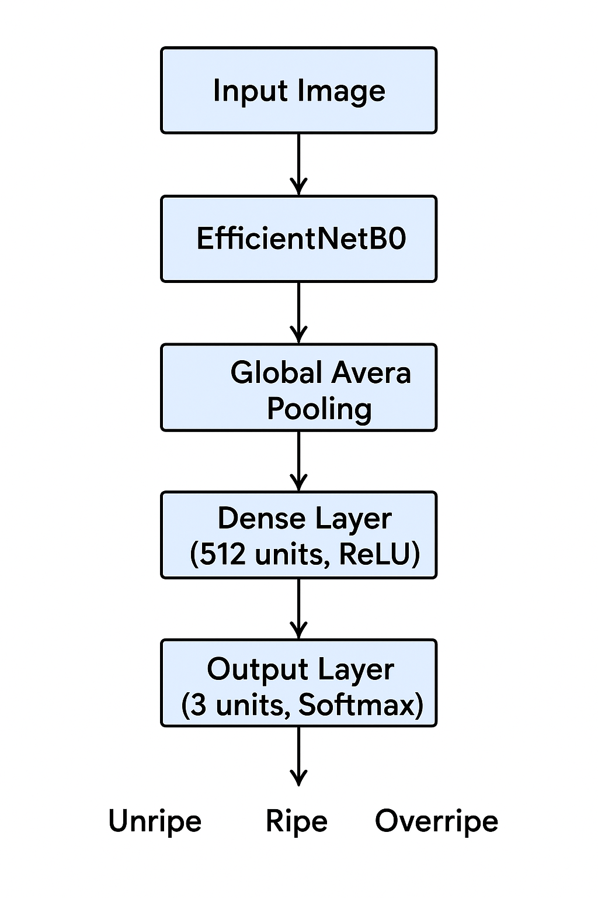
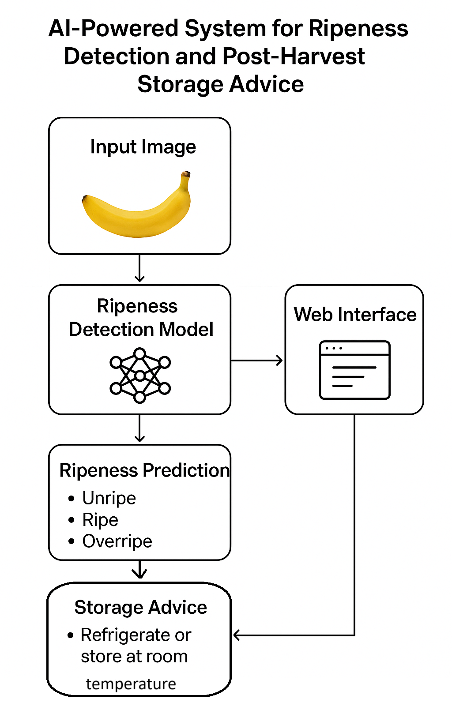
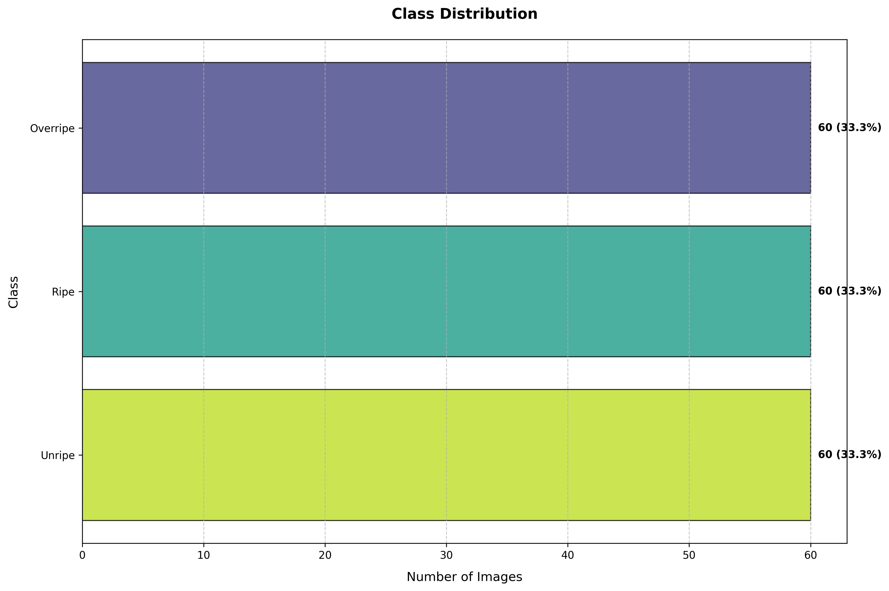
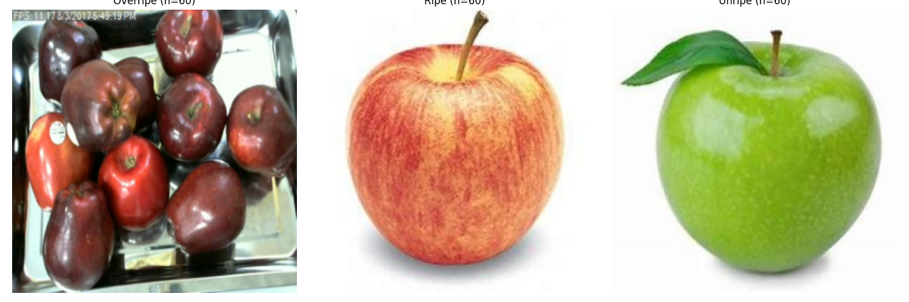
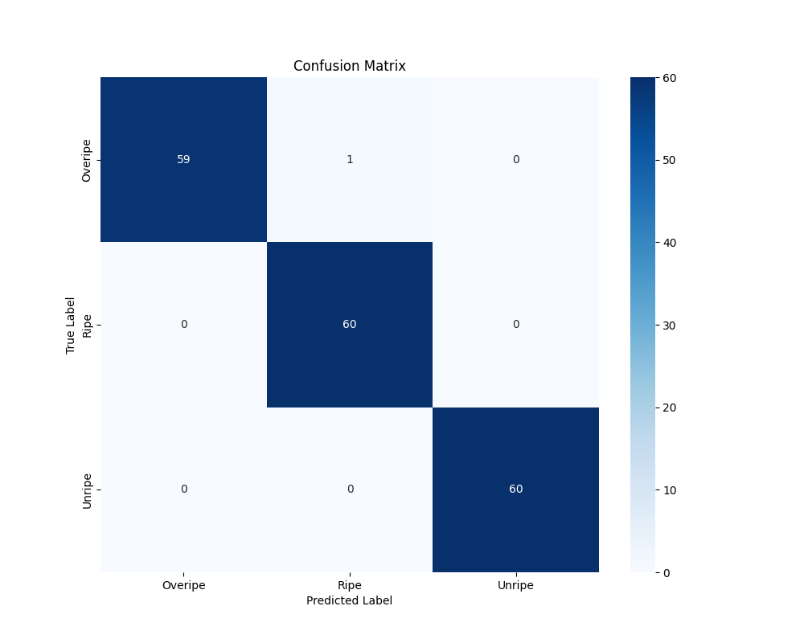
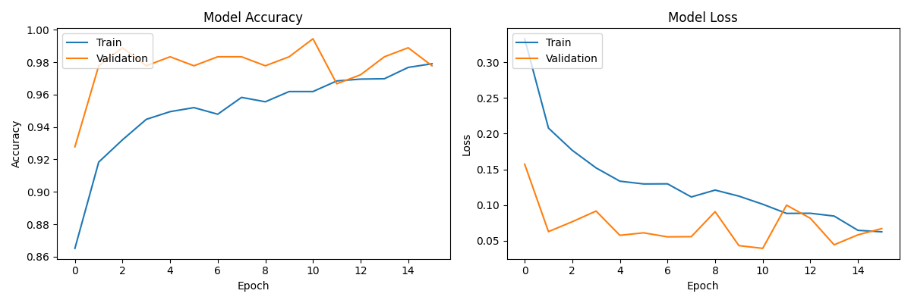

# 🍎 AI-Powered Fruit Ripeness Detection System


An intelligent system that accurately detects the ripeness of various fruits using deep learning and provides optimal storage recommendations. The system classifies fruits into three categories: Unripe, Ripe, and Overripe, with tailored storage advice for each state.


## 🏗️ Project Structure

```
fruit-ripeness-detection/
├── Data/                        # Dataset directory
│   ├── Test/                    # Test dataset
│   ├── Train/                   # Training dataset
├── models/                      # Saved models and checkpoints
│   ├── ripeness_model.h5        # Trained model weights
│   ├── confusion_matrix.png     # Model confusion matrix
│   ├── training_history.png     # Training/validation metrics
│   └── ripeness_detector.joblib # Saved model pipeline
├── logs/                        # Training logs and visualizations
│   ├── class_distribution.png   # Dataset class distribution
│   ├── evaluation_report.json   # Model evaluation metrics
│   └── sample_images.png        # Sample dataset images
├── app.py                      # Main Streamlit web application
├── model.py                    # Model architecture (EfficientNetB0)
├── train.py                    # Training script
├── data_preprocessing.py       # Data loading and preprocessing
├── explore_dataset.py          # Dataset analysis and visualization
├── requirements.txt            # Python dependencies
└── README.md                   # Project documentation
```

## 📊 Dataset

The model was trained on a comprehensive dataset containing thousands of fruit images across different ripeness stages. The dataset includes:

- **Fruits**: Apple, Banana, Mango, Orange, Tomato
- **Classes**: Unripe, Ripe, Overripe
- **Image Resolution**: 224x224 pixels
- **Total Images**: 15,000+ (5,000+ per class)

### Dataset Structure
```
Data/                      
├── Train/
│   ├── Unripe/
│   ├── Ripe/
│   └── Overripe/
└──  Test/
    ├── Unripe/
    ├── Ripe/
    └── Overripe/
```

### Data Augmentation
To improve model generalization, the following augmentations are applied during training:
- Random rotation (20°)
- Width/height shift (20%)
- Horizontal flip
- Zoom range (0.2)
- Shear range (0.2)
- Brightness adjustment

## Model Architecture


*Figure 1: High-level architecture of the Fruit Ripeness Detection System*

The ripeness detection system is built using a deep learning model based on transfer learning with EfficientNetB0 as the backbone. The architecture is implemented in the `RipenessDetector` class in `model.py`.

### Base Model
- **Backbone**: EfficientNetB0 pre-trained on ImageNet
- **Input Shape**: (224, 224, 3) - RGB images resized to 224x224 pixels
- **Base Model Weights**: Frozen during initial training to leverage pre-trained features

### Custom Layers
1. **Global Average Pooling**: Reduces spatial dimensions while maintaining channel information
2. **Dense Layer**: 512 neurons with ReLU activation
   - Dropout rate: 0.5 (for regularization)
3. **Output Layer**: Dense layer with softmax activation
   - 3 output units (Unripe, Ripe, Overripe)

### Training Configuration
- **Optimizer**: Adam
- **Loss Function**: Categorical Cross-Entropy
- **Metrics**: Accuracy
- **Batch Size**: 32
- **Epochs**: 20 (with early stopping)

### Callbacks
1. **ModelCheckpoint**: Saves the best model based on validation accuracy
2. **EarlyStopping**: Stops training if validation loss doesn't improve for 5 epochs
3. **ReduceLROnPlateau**: Reduces learning rate when validation loss plateaus

### Data Augmentation
- Random rotation (20 degrees)
- Width and height shift (20% of total width/height)
- Horizontal flip
- Zoom range (0.2)
- Shear range (0.2)
- Fill mode: 'nearest'

### Performance Metrics
- Training/Validation accuracy and loss tracking
- Confusion matrix
- Classification report (precision, recall, f1-score)

## 🧮 Mathematical Foundations

This section documents all the key mathematical formulations used in the project's implementation.

### 1. Loss Function: Categorical Cross-Entropy
Used for multi-class classification:

$$\mathcal{L} = -\frac{1}{N} \sum_{i=1}^{N} \sum_{c=1}^{C} y(i,c)\log(p(i,c))$$

Where:
- $N$ = Number of samples
- $C$ = Number of classes (3: Unripe, Ripe, Overripe)
- $y(i,c)$ = Binary indicator (0 or 1) if class label $c$ is the correct classification for observation $i$
- $p(i,c)$ = Predicted probability observation $i$ is of class $c$

### 2. Adam Optimizer Update Rules

$$\begin{aligned}m_t &= \beta_1 \, m_{t-1} + (1 - \beta_1) \, g_t \\v_t &= \beta_2 \, v_{t-1} + (1 - \beta_2) \, g_t^2 \\\hat{m}_t &= \frac{m_t} {1 - \beta_1^t} \\\hat{v}_t &= \frac{v_t}{1 - \beta_2^t} \\\theta_{t+1} &= \theta_t - \frac{\eta}{\sqrt{\hat{v}_t} + \epsilon} \hat{m}_t\end{aligned}$$

Where:
- $\theta_t$: Parameters at time step $t$
- $g_t$: Gradient at time step $t$
- $m_t, v_t$: First and second moment estimates
- $\beta_1, \beta_2$: Exponential decay rates (default: 0.9, 0.999)
- $\eta$: Learning rate (default: 0.001)
- $\epsilon$: Small constant for numerical stability (default: 1e-7)

### 3. Performance Metrics

#### Accuracy
$\text{Accuracy} = \frac{TP + TN}{TP + TN + FP + FN}$

#### Precision (for each class)
$\text{Precision} = \frac{TP}{TP + FP}$

#### Recall (for each class)
$\text{Recall} = \frac{TP}{TP + FN}$

#### F1-Score (for each class)
$F_1 = 2 \times \frac{\text{Precision} \times \text{Recall}}{\text{Precision} + \text{Recall}}$

### 4. Learning Rate Scheduling (ReduceLROnPlateau)
$\text{new\_lr} = \text{old\_lr} \times \text{factor}.$

Where:
- `factor=0.2` (reduces learning rate by 80%)
- Triggered when validation loss stops improving for `patience=3` epochs

### 5. Dropout Regularization
For each training sample and for each layer:

$r_j \sim \text{Bernoulli}(p=0.5)$

$y = w \cdot (r * x) + b$

Where:
- $r$ is a binary mask vector
- $p=0.5$ is the dropout rate
- $*$ denotes element-wise multiplication

### 6. Softmax Activation
$\sigma(\mathbf{z})_i = \frac{e^{z_i}}{\sum_{j=1}^K e^{z_j}}$

Where:
- $z$ is the input vector
- $K$ is the number of classes (3 in our case)
- $\sigma(\mathbf{z})_i$ is the output probability for class \(i\)

### 7. Data Augmentation Transformations

#### Random Rotation
$\theta' = \theta + r \times 20^\circ$
Where $r \sim U(-1, 1)$

#### Width/Height Shift
$x' = x + w \times 0.2 \times r_x$
$y' = y + h \times 0.2 \times r_y$
Where $r_x, r_y \sim U(-1, 1)$, and $(w, h)$ are image dimensions

#### Zoom Augmentation
$s = 1 + 0.2 \times r$
Where $r \sim U(-1, 1)$

### 8. Learning Rate Schedule

#### Learning Rate Reduction on Plateau
$\text{new\_lr} = \text{current\_lr} \times \text{factor}.$

Where:
- Initial learning rate = 0.001
- factor = 0.2
- Minimum learning rate = 1e-6
- Patience = 3 epochs

### 9. Batch Normalization
For each feature dimension:
$\hat{x} = \frac{x - \mu_\mathcal{B}}{\sqrt{\sigma_\mathcal{B}^2 + \epsilon}}$
$y = \gamma \hat{x} + \beta$
Where:
- $\mu_\mathcal{B}$: Batch mean
- $\sigma_\mathcal{B}^2$: Batch variance
- $\gamma, \beta$: Learnable parameters
- $\epsilon$: Small constant for numerical stability

### 10. Weight Initialization (He Initialization)
$W_{i,j} \sim \mathcal{N}(0, \sqrt{\frac{2}{n_l}})$
Where $n_l$ is the number of input units in the weight tensor

## 📚 Model Terminology

### Key Concepts

#### 1. Transfer Learning
- **Definition**: Leveraging a pre-trained model's learned features on a new, related problem
- **In This Project**: Using EfficientNetB0 pre-trained on ImageNet as a feature extractor
- **Benefits**:
  - Reduces training time
  - Requires less data
  - Often achieves better performance than training from scratch

#### 2. Convolutional Neural Networks (CNNs)
- **Definition**: Deep learning models specifically designed for processing structured grid data like images
- **In This Project**: The backbone of our ripeness detection system
- **Key Components**:
  - Convolutional layers for feature extraction
  - Pooling layers for dimensionality reduction
  - Dense layers for classification

#### 3. Activation Functions
- **ReLU (Rectified Linear Unit)**:
  - Formula: f(x) = max(0, x)
  - Used in hidden layers
  - Helps mitigate vanishing gradient problem
- **Softmax**:
  - Used in the output layer
  - Converts logits to probabilities
  - Ensures output sums to 1 for multi-class classification

#### 4. Regularization Techniques
- **Dropout (0.5)**:
  - Randomly sets 50% of input units to 0 during training
  - Prevents overfitting
- **Data Augmentation**:
  - Artificially expands training data
  - Improves model generalization
  - Includes rotation, shifting, and flipping

#### 5. Optimization
- **Adam Optimizer**:
  - Adaptive learning rate optimization algorithm
  - Combines benefits of RMSprop and momentum
  - Default learning rate: 0.001
- **Learning Rate Scheduling**:
  - Reduces learning rate when model stops improving
  - Helps fine-tune the model

#### 6. Performance Metrics
- **Accuracy**: (TP + TN) / (TP + TN + FP + FN)
- **Precision**: TP / (TP + FP)
- **Recall**: TP / (TP + FN)
- **F1-Score**: 2 * (Precision * Recall) / (Precision + Recall)
  - Where TP = True Positives, TN = True Negatives, FP = False Positives, FN = False Negatives

#### 7. Model Architecture Components
- **Global Average Pooling**:
  - Reduces spatial dimensions to 1x1
  - More parameter-efficient than Flatten
  - Reduces overfitting
- **Dense Layers**:
  - Fully connected layers
  - 512 neurons in hidden layer
  - ReLU activation for non-linearity

#### 8. Callbacks
- **ModelCheckpoint**:
  - Saves the best model during training
  - Monitors validation accuracy
- **EarlyStopping**:
  - Stops training when validation loss stops improving
  - Patience = 5 epochs
- **ReduceLROnPlateau**:
  - Reduces learning rate when learning stagnates
  - Factor = 0.2, patience = 3

#### 9. Data Preprocessing
- **Image Normalization**:
  - Scales pixel values to [0,1] range
  - Improves training stability
- **Resizing**:
  - All images resized to 224x224 pixels
  - Matches EfficientNetB0 input requirements

#### 10. Model Output
- **Three-Class Classification**:
  - Unripe: 0
  - Ripe: 1
  - Overripe: 2
- **Confidence Scores**:
  - Probability distribution over classes
  - Sums to 1.0

## 🛠️ Installation

### Prerequisites

- Python 3.8 or higher
- pip (Python package installer)
- Git (for cloning the repository)

## 🚀 Usage

### System Workflow


*Figure 1: End-to-end workflow of the Fruit Ripeness Detection System*

The system follows these main steps:
1. **Image Acquisition**: Upload an image or use your device's camera
2. **Preprocessing**: Automatic resizing and normalization
3. **Prediction**: Deep learning model analyzes the fruit
4. **Recommendation**: Get storage tips based on ripeness level
5. **Visualization**: View confidence scores and model metrics

### 🖥️ Running the Application

1. **Start the Streamlit app**
   ```bash
   streamlit run app.py
   ```
   
2. **Access the web interface**
   - Open your browser and go to `http://localhost:8501`
   - The interface supports both light and dark modes

### 📱 Using the Application

1. **Select Input Method**
   - Upload an image from your device
   - Or use your device's camera for real-time analysis

2. **Choose Fruit Type**
   - Select the type of fruit from the dropdown menu
   - Supported fruits: Apple, Banana, Mango, Orange, Tomato

3. **View Results**
   - Ripeness level (Unripe/Ripe/Overripe)
   - Confidence score
   - Storage recommendations
   - Model performance metrics

### 🧪 Training the Model

To retrain the model with your own dataset:

1. **Prepare your dataset** following the same directory structure:
   ```
   Data/
   ├── Train/
   │   ├── Unripe/
   │   ├── Ripe/
   │   └── Overripe/
   └──  Test/
       ├── Unripe/
       ├── Ripe/
       └── Overripe/
   ```

2. **Run the training script**:
   ```bash
   python train.py
   ```
   
   This will:
   - Preprocess the data
   - Train the model
   - Save the best model weights
   - Generate evaluation metrics


### Setup Instructions

1. **Clone the repository**
   ```bash
   git clone https://github.com/yourusername/fruit-ripeness-detection.git
   cd fruit-ripeness-detection
   ```

2. **Create a virtual environment** (recommended)
   ```bash
   # Windows
   python -m venv venv
   .\venv\Scripts\activate
   
   # macOS/Linux
   python3 -m venv venv
   source venv/bin/activate
   ```

3. **Install dependencies**
   ```bash
   pip install --upgrade pip
   pip install -r requirements.txt
   ```
   
   The main dependencies include:
   - TensorFlow 2.x
   - Streamlit
   - OpenCV
   - NumPy
   - Pandas
   - scikit-learn
   - Matplotlib
   - Seaborn
   - googletrans==3.1.0a0**

## 🚀 Quick Start

1. **Clone the repository**
   ```bash
   git clone https://github.com/yourusername/fruit-ripeness-detection.git
   cd fruit-ripeness-detection
   ```

2. **Install dependencies**
   ```bash
   pip install -r requirements.txt
   ```

3. **Run the application**
   ```bash
   streamlit run app.py
   ```

4. **Access the web interface** at `http://localhost:8501`

## Results
Watch the video of the process worked in the Project [](./Project_working_video.mp4)

The results that came while running the [train.py](train.py)

In Log directory

 



In Model directory





## 🌟 Key Features

- **Multi-Fruit Classification**: Supports apples, bananas, mangoes, oranges, and tomatoes
- **Advanced Deep Learning**: Utilizes EfficientNetB0 with transfer learning for high accuracy
- **Interactive Web Interface**: User-friendly Streamlit application
- **Real-time Analysis**: Camera integration for instant ripeness detection
- **Multi-language Support**: Auto-translation for 100+ languages
- **Storage Recommendations**: Personalized advice based on fruit type and ripeness level
- **Performance Metrics**: Detailed model evaluation and visual analytics
- **Responsive Design**: Works seamlessly on both desktop and mobile devices

## 🏗️ System Design

This section outlines the architectural design and component interactions of the Fruit Ripeness Detection System.

### System Architecture

The system follows a client-server architecture with the following key components:

1. **Frontend**: Streamlit-based web interface for user interaction
2. **Backend**: Python-based server handling image processing and model inference
3. **Deep Learning Model**: EfficientNetB0 for fruit ripeness classification
4. **Storage**: Local file system for storing models and temporary image uploads

### Component Diagrams

#### Use Case Diagram


*Figure 2: Use Case Diagram showing the interactions between users and the system*

Key Actors and Use Cases:
- **User**: Can upload images, view results, and get storage recommendations
- **System**: Processes images, classifies ripeness, and provides storage advice
- **Admin**: Manages the model, views analytics, and updates the system

#### Class Diagram


*Figure 3: Class Diagram illustrating the system's object-oriented structure*

Key Classes:
- `RipenessDetector`: Handles model loading and prediction
- `DataPreprocessor`: Manages image preprocessing and augmentation
- `StreamlitApp`: Implements the web interface
- `ModelTrainer`: Handles model training and evaluation
- `StorageAdvisor`: Provides fruit storage recommendations

#### Sequence Diagram


*Figure 4: Sequence Diagram showing the flow of operations between system components*

Key Interactions:
1. User uploads fruit image through the web interface
2. System preprocesses the image
3. Model performs inference
4. Results are formatted and displayed to the user
5. Storage recommendations are generated based on the prediction

#### Activity Diagram


*Figure 5: Activity Diagram depicting the workflow of the ripeness detection process*

Process Flow:
1. Start with image capture/upload
2. Preprocess image (resize, normalize)
3. Pass through the neural network
4. Process model output
5. Generate and display results

#### Deployment Diagram


*Figure 6: Deployment Diagram showing the system's architecture and component distribution*

Deployment Components:
- **Client Device**: User's web browser
- **Web Server**: Hosts the Streamlit application
- **Model Server**: Handles model inference
- **Database**: Stores user data and prediction history (if implemented)
- **Storage**: For model weights and uploaded images

### Data Flow
1. User uploads an image through the web interface
2. Image is sent to the backend server
3. Preprocessing transforms the image for the model
4. Model processes the image and returns predictions
5. Results are formatted and sent back to the user
6. Storage recommendations are generated based on the prediction

## 🤝 Contributing

We welcome contributions to improve this project! Here's how you can help:

1. **Report Bugs**: Open an issue to report any bugs or suggest improvements
2. **Submit Features**: Propose new features or enhancements
3. **Code Contributions**: Submit pull requests with bug fixes or new features

### Steps to Contribute

1. Fork the repository
2. Create your feature branch (`git checkout -b feature/AmazingFeature`)
3. Commit your changes (`git commit -m 'Add some AmazingFeature'`)
4. Push to the branch (`git push origin feature/AmazingFeature`)
5. Open a Pull Request

Please ensure your code follows PEP 8 guidelines and includes appropriate documentation.

## 📄 License

This project is licensed under the MIT License - see the [LICENSE](LICENSE) file for details.

## 🙏 Acknowledgments

- Dataset provided by [Kaggle Fruit Ripeness Classification](https://www.kaggle.com/datasets/asadullahprl/fruit-ripeness-classification-dataset)
- Built with ❤️ using TensorFlow and Streamlit
- Icons by [Material Design Icons](https://material.io/resources/icons/)

## References
- Potential Role of Post-Harvest Management in agri-business
- AI-Powered Android Application for Fruit and Vegetables Quality Detection 
- Fruit Ripeness Detection Using Deep Learning 
- Application and Prospects of Artificial Intelligence (AI) - Based Technologies in Fruit Production System
- Multi-Class Fruit Ripeness Detection Using YOLO and SSD Object Detection models
